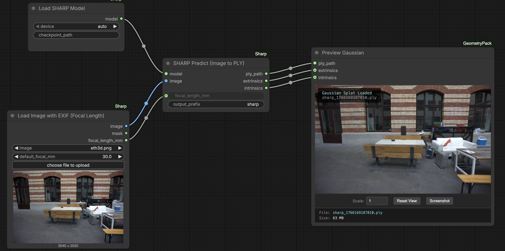

# ComfyUI-Sharp

ComfyUI wrapper for [SHARP](https://arxiv.org/abs/2512.10685) by [Apple](https://github.com/apple/ml-sharp) - monocular 3D Gaussian Splatting in under 1 second.

Model auto-downloads on first run. For offline use, place `sharp_2572gikvuh.pt` in `ComfyUI/models/sharp/`.

## Nodes

- **Load SHARP Model** - (down)Load the SHARP model
- **SHARP Predict** - Generate 3D Gaussians from a single image
- **Load Image with EXIF** - Load image and auto-extract focal length from EXIF (35mm equivalent)

Images with EXIF data get focal length auto-calculated when using the Load Image with EXIF node.

## Credits

Thanks to Apple for releasing SHARP as open source.
