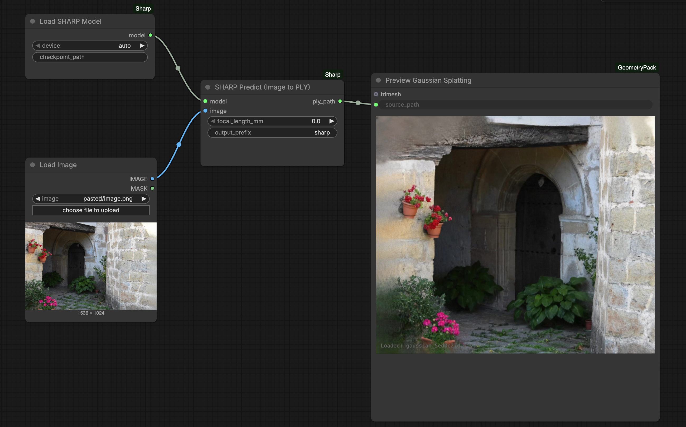

# ComfyUI-Sharp

ComfyUI wrapper for [SHARP](https://arxiv.org/abs/2512.10685) - monocular 3D Gaussian Splatting in under 1 second.



## Installation

```bash
pip install -r requirements.txt
```

## Nodes

- **Load SHARP Model** - Load the SHARP model
- **SHARP Predict** - Generate 3D Gaussians from a single image
